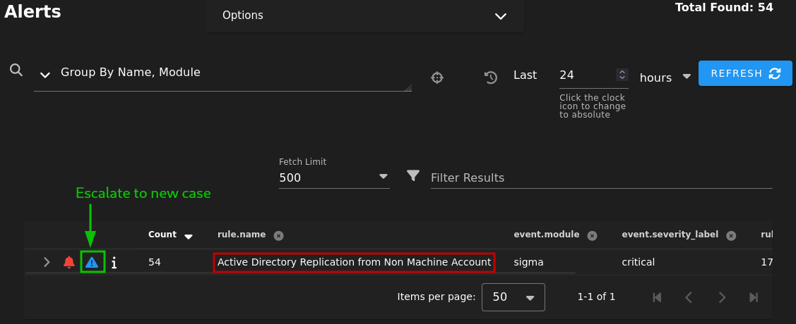
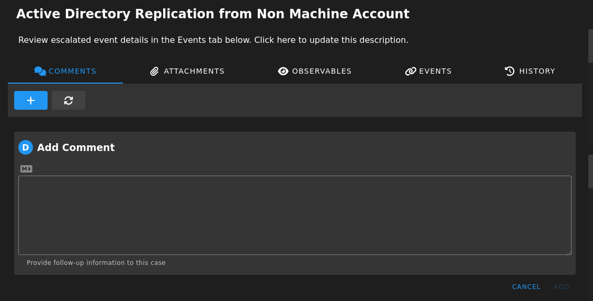
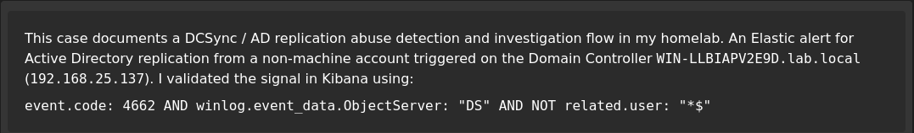
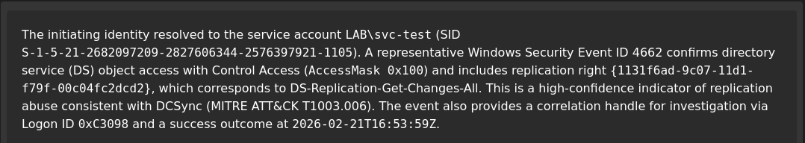
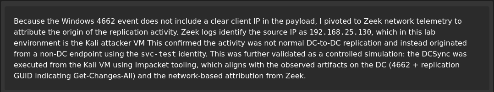
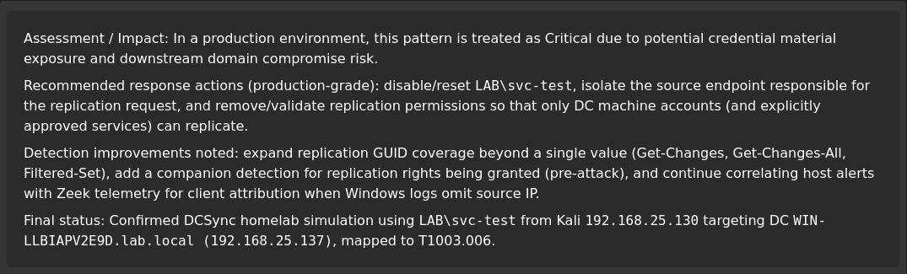
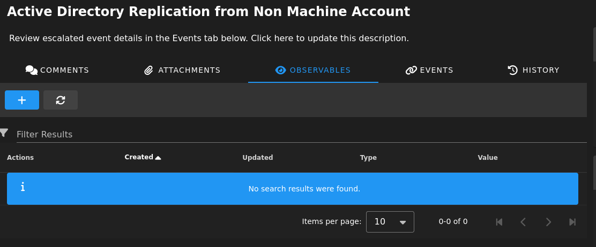

# Case Study: DCSync via AD Replication (T1003.006)

> **Goal:** Demonstrate an end-to-end SOC workflow in my homelab — detection, escalation to case, investigation pivots, containment, and tuning.
>

---

## Executive summary

An alert fired for **Active Directory replication activity performed by a non-machine account**, consistent with **DCSync** (MITRE ATT&CK **T1003.006**).  
DCSync abuses legitimate AD replication APIs to request credential material, effectively simulating a domain controller replication request.

- **Detection:** Custom Sigma rule (“Active Directory Replication from Non Machine Account”)
- **Primary signal:** Windows Security **Event ID 4662** on the Domain Controller, with replication-right GUIDs present
- **Action:** Escalated alert into an Elastic Security **Case**, documented triage, and performed pivots to identify the initiating account and source host
- **Outcome:** Containment actions + rule-tuning notes captured for future hardening

**MITRE mapping**
- **T1003.006 – OS Credential Dumping: DCSync**

---

## Lab environment (relevant assets)

This case occurred inside my isolated SOC homelab network:

- **Security Onion:** Fleet + Kibana (Elastic Security), Zeek, Suricata  
  See: [`../vm/security-onion.md`](../vm/security-onion.md)
- **Domain Controller:** `WIN-LLBIAPV2E9D.lab.local` (`192.168.25.137`) — AD DS/DNS, Sysmon + Elastic Agent  
  See: [`../vm/dc.md`](../vm/dc.md)
- **Workstation:** `Workstation-A.lab.local` (`192.168.25.141`) — Sysmon + Elastic Agent  
  See: [`../vm/workstation.md`](../vm/workstation.md)
- **Topology overview:** [`../topology.md`](../topology.md)

---

## Detection logic (what fired)

### Why Event ID 4662 matters
On Domain Controllers, **Event ID 4662** (“An operation was performed on an object”) can record directory service access events when auditing/SACLs are configured. Replication-related access can be identified by specific “control access right” GUIDs.

### Replication GUIDs commonly associated with DCSync
These GUIDs are frequently used to identify replication rights in logs:

- **DS-Replication-Get-Changes** — `1131f6aa-9c07-11d1-f79f-00c04fc2dcd2`
- **DS-Replication-Get-Changes-All** — `1131f6ad-9c07-11d1-f79f-00c04fc2dcd2`
- **DS-Replication-Get-Changes-In-Filtered-Set** — `89e95b76-444d-4c62-991a-0facbeda640c`

### Where the rule lives in this project
Full rule + writeup: **Detections → Active Directory**  
- [`../detections/AD.md`](../detections/AD.md)

**High-level logic:**
- Look for `event.code: 4662`
- `ObjectServer: DS`
- `Properties` contains replication GUID(s)
- Exclude replication performed by the DC machine account (`*$`)

---

## Case management workflow (Elastic Security)

### 1) Escalate alert to a case
From **Security → Alerts**, I escalated the alert (“Active Directory Replication from Non Machine Account”) into a new case.



### 2) Triage notes in the case
In the case **Comments** tab, I captured:
- suspected technique (T1003.006)
- impacted asset (DC)
- initiating identity (user/service account)
- immediate pivots performed
- containment decision







### 3) Observables
- `user.name` (suspected account)
- `host.name` (source host)
- source IP (if available)
- domain name



---

## Triage: what I validated first

### Key questions
1. **Is the initiating account expected to replicate?**  
   - DCs normally replicate (machine accounts end with `$`)  
   - Non-machine accounts replicating is high-risk
2. **Where did the replication request come from?**  
   - Which host/user initiated it?
3. **Is there preceding activity that explains access?**  
   - suspicious logons, privilege assignment, group membership changes

### Fast pivots (KQL examples)

**Replication event slice**
```kql
event.code: 4662 and winlog.event_data.ObjectServer: "DS"