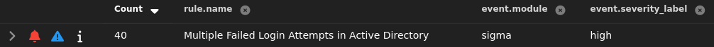
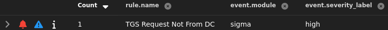
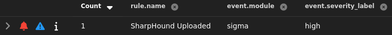
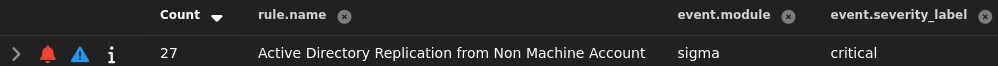
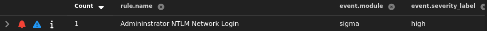
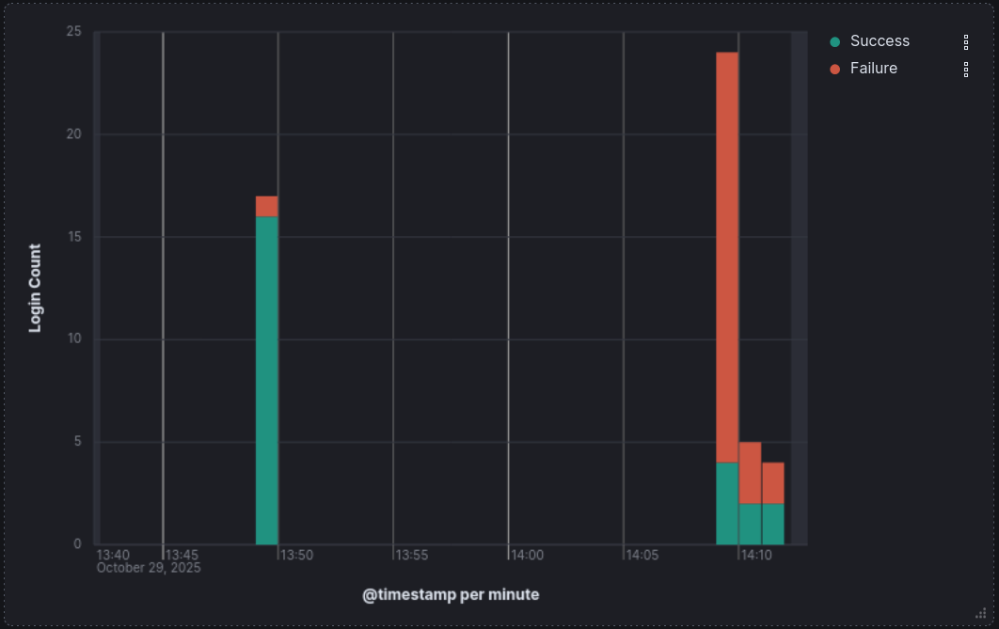
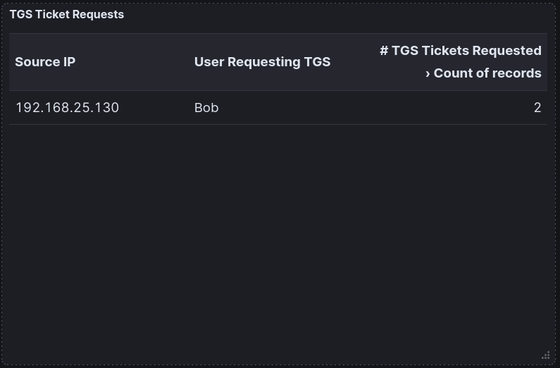
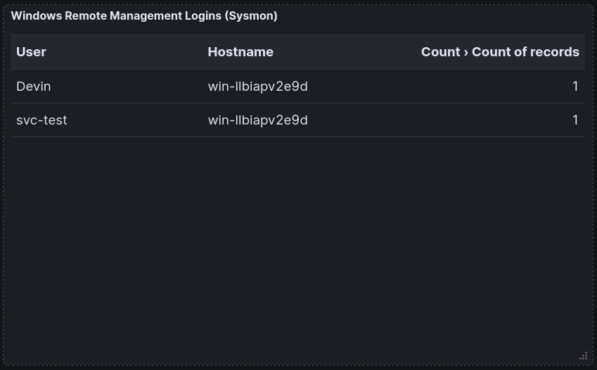
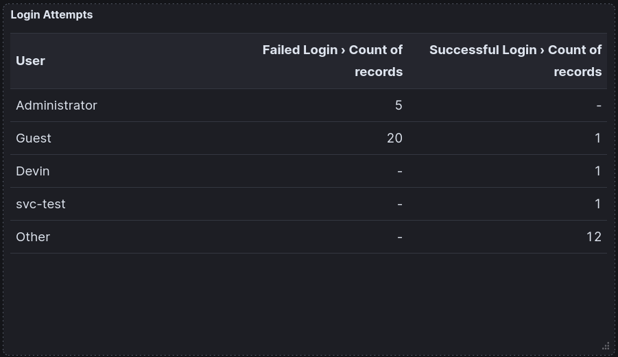

# Active Directory

This section documents custom sigma rules and visualizations for my Active Directory environment. Each item includes the **ATT&CK technique**, **signal logic**, and **validation evidence**.

## Brute Forcing Guest Account (T1110.001)

**Sigma rule (winlog)**:
```winlog
title: 'Multiple Failed Login Attempts in Active Directory'
id: 624d9509-7f05-47e7-932e-078e145a7a42
status: 'stable'
description: 'Detects multiple failed login attempts (Event ID 4625) that may indicate brute forcing against Active Directory.'
author: 'Devin'
date: '2025/10/18'
logsource:
  product: windows
  service: security
detection:
  selection:
    EventID: 4625
condition: selection
level: 'high'
```

**Validation:** Ran `nxc ldap 192.168.25.137 -u 'Guest' -p /usr/share/wordlists/rockyou.txt --ignore-pw-decoding`; alert fired and triaged.
{ loading=lazy }


## Kerberoast of svc-test (T1558.003 & T1110.002 & T1078.002)

**Sigma rule (winlog)**:
```winlog
title: 'TGS Request Not From DC'
id: a85a9ac4-a6be-440a-9b63-46943da0fe36
status: 'stable'
description: 'Indicative of potential kerberoast attack.'
author: 'Devin'
date: '2025/10/18'
logsource:
  product: windows
  service: security
detection:
  selection:
    EventID: 4769
  name:
    RelatedUser: 'WIN-LLBIAPV2E9D$'
  condition: selection and not name
level: 'high'
```

**Validation:** Ran `nxc ldap 192.168.25.137 -u 'Bob' -p '_________' --kerberoasting kerbroast.txt`; alert fired and triaged.
{ loading=lazy }

## Upload of SharpHound (T1105 & T1047)

**Sigma rule (sysmon)**:
```sysmon
title: 'SharpHound Uploaded'
id: 6bc8dee8-a7d2-409a-af69-473a9ab94dfa
status: 'stable'
description: 'SharpHound was uploaded through remote management shell'
author: 'Devin'
date: '2025/10/18'
logsource:
  product: windows
  service: sysmon
detection:
  selection:
    EventID: 11
    Image|endswith : '\wsmprovhost.exe'
    TargetFilename|endswith : '\SharpHound.exe'
condition: selection
level: 'high'
```

**Validation:** Ran `upload SharpHound.exe` from an evil-winrm shell; alert fired and triaged.
{ loading=lazy }

## DCSync (T1003.006 & T1078.002)
**Sigma rule (winlog)**:
```winlog
title: 'Active Directory Replication from Non Machine Account'
id: 88e4eb0a-8d72-4164-87d3-d5101e97a3b4
status: 'stable'
description: |
Triggers after Active Directory Replication for a non machine account (indicative of a DCSYNC attack)
author: 'Devin'
date: '2025/10/20'
logsource:
  service: security
  product: windows
detection:
  selection:
    EventID: 4662
    winlog.event_data.ObjectServer: DS
    winlog.event_data.Properties|contains: 1131f6aa-9c07-11d1-f79f-00c04fc2dcd2
  dc:
    User: WIN-LLBIAPV2E9D$
  condition: selection and not dc
level: 'critical'
```

**Validation:** Ran `impacket-secretsdump -just-dc LAB/svc-test:'_________'@WIN-LLBIAPV2E9D.lab.local`; alert fired and triaged.
{ loading=lazy }

## Pass-the-hash to Login as Domain Admin (T1550.002 & T1021.006)
**Sigma rule (sysmon)**:
```sysmon
title: 'Admininstrator NTLM Network Login'
id: 6b53b892-2e05-44cd-bcfc-e274ee696ea9
status: 'stable'
description: 'Detects the Administrator account completing an NTLM network login, possibly indicating a pass-the-hash attack'
author: 'Devin'
date: '2025/10/18'
logsource:
  product: windows
  service: security
detection:
  selection:
    EventID: 4624
    LogonType: '3'
    AuthenticationPackageName: NTLM
    TargetUserName: Administrator
  condition: selection
level: 'high'
```

**Validation:** Ran `evil-winrm -i 192.168.25.137 -u 'Administrator' -H '__________________’`; alert fired and triaged.
{ loading=lazy }


## Dashboard: Successful/Failed Login Attempts Timeline Bar Graph
{ loading=lazy }

## Dashboard: TGS Ticket Requests Table
{ loading=lazy }

## Dashboard: Windows Remote Management Logins Table
{ loading=lazy }

## Dashboard: Login Attempts Table
{ loading=lazy }
