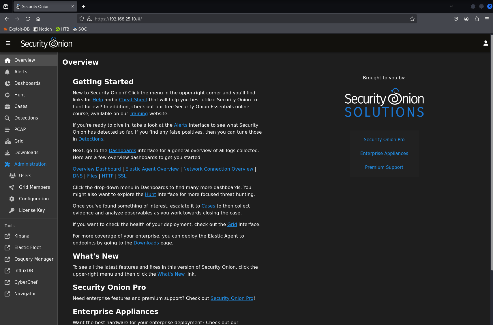

# Windows Server 2025 – Domain Controller

## Purpose
Active Directory domain services; realistic enterprise authentication/authorization traffic.

## Specs
- Hostname: `WIN-LLBIAPV2E9D.lab.local`
- IP: `192.168.25.137`
- Roles: AD DS, DNS
- Logging: Sysmon, Windows event forwarding via Elastic Agent
- 16gb of memory

## Build Notes
1. Install Server 2025 → promote to new forest `lab.local`.
2. Create OUs (Workstations, Users, Service Accounts).

## Validation
- Join `Workstation-A.lab.local` to domain:
{ loading=lazy }
- Confirm Kerberos/NTLM events in Kibana:
```
event.code: 4624
```
{ loading=lazy }

## Install (step-by-step)
<Add AD Users & Computers, GPOs, sample event queries>
{ loading=lazy }
{ loading=lazy }
{ loading=lazy }
{ loading=lazy }
{ loading=lazy }
{ loading=lazy }
{ loading=lazy }
{ loading=lazy }
{ loading=lazy }
{ loading=lazy }
{ loading=lazy }
{ loading=lazy }
{ loading=lazy }
{ loading=lazy }
{ loading=lazy }
{ loading=lazy }
{ loading=lazy }
{ loading=lazy }
{ loading=lazy }
{ loading=lazy }
{ loading=lazy }
{ loading=lazy }
{ loading=lazy }
{ loading=lazy }
