# Ubuntu – Webserver (DVWA)

## Purpose
Intentionally vulnerable web app.

## Specs
- IP: `192.168.26.10` (DMZ)
- Services: Nginx/Apache, PHP/MySQL, DVWA
- Security: Minimal hardening, **egress restricted**, unique creds

## Build Notes
1. Install Ubuntu Server → static IP `192.168.26.10`.
2. Install DVWA stack (web/PHP/MySQL), set DVWA security level to *low* for testing.
3. Elastic Agent enrolled; ship nginx/apache, auth, and system logs to Fleet.
4. Expose via firewall NAT: WAN → 80/443 → `192.168.26.10`.
5. Optional: Suricata inline IPS on DMZ at the firewall.

## Validation
- From Internet/Kali: run Nikto, SQLi/XSS probes, file uploads.
- In Kibana: confirm access logs, WAF/Suricata alerts, and Zeek HTTP logs.
- Confirm DVWA is up and running: Go to http://192.168.25.142/DVWA
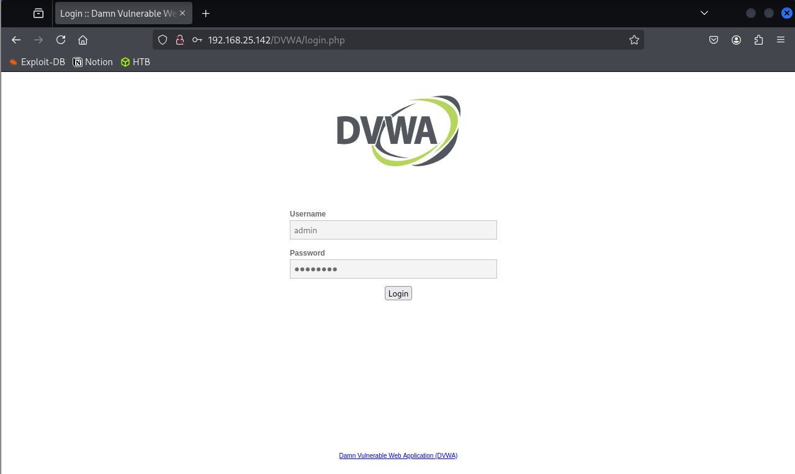{ loading=lazy }

## Install (step-by-step)
<Add NAT/port‑forward rule, DVWA login, alerts>
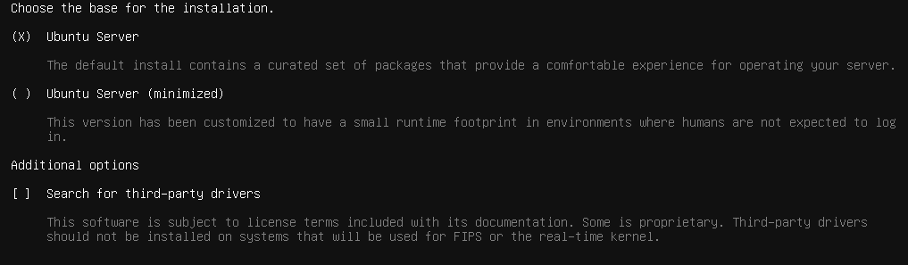{ loading=lazy }
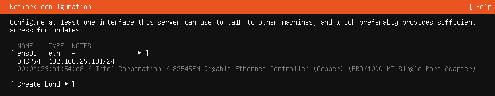{ loading=lazy }
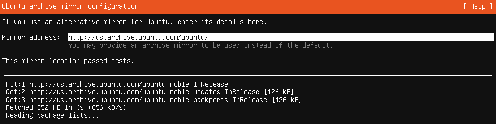{ loading=lazy }
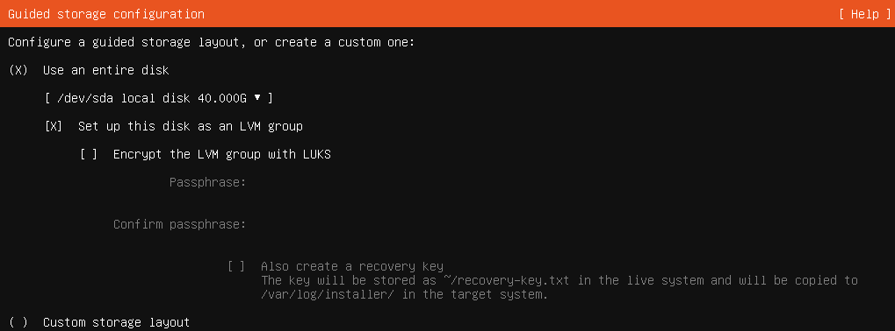{ loading=lazy }
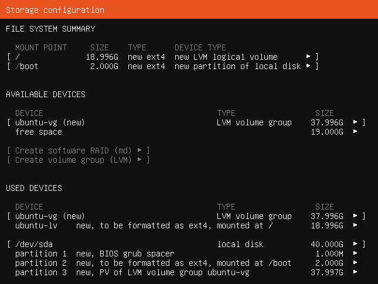{ loading=lazy }
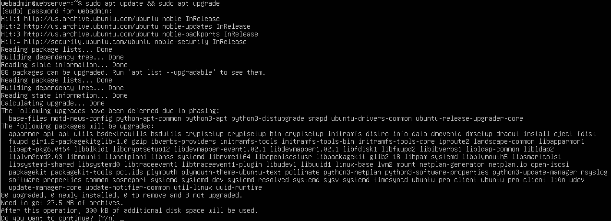{ loading=lazy }
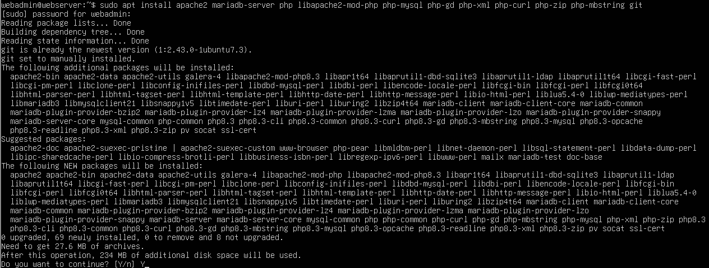{ loading=lazy }
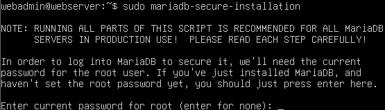{ loading=lazy }
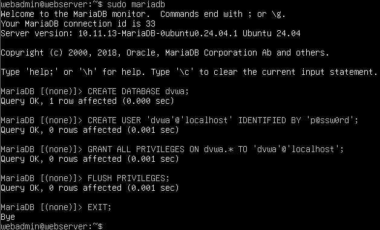{ loading=lazy }
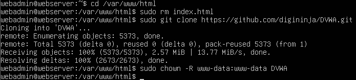{ loading=lazy }
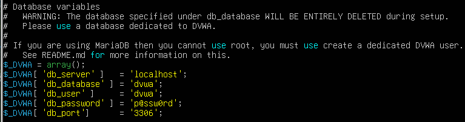{ loading=lazy }
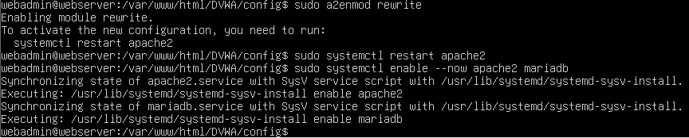{ loading=lazy }
{ loading=lazy }
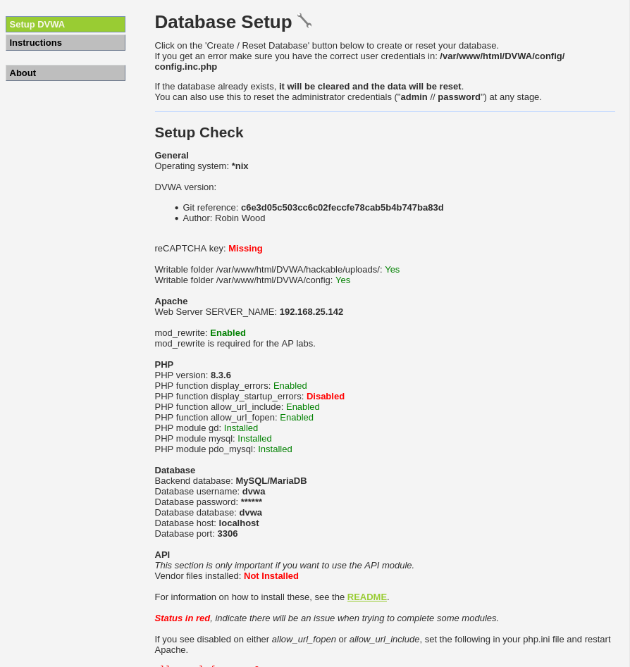{ loading=lazy }
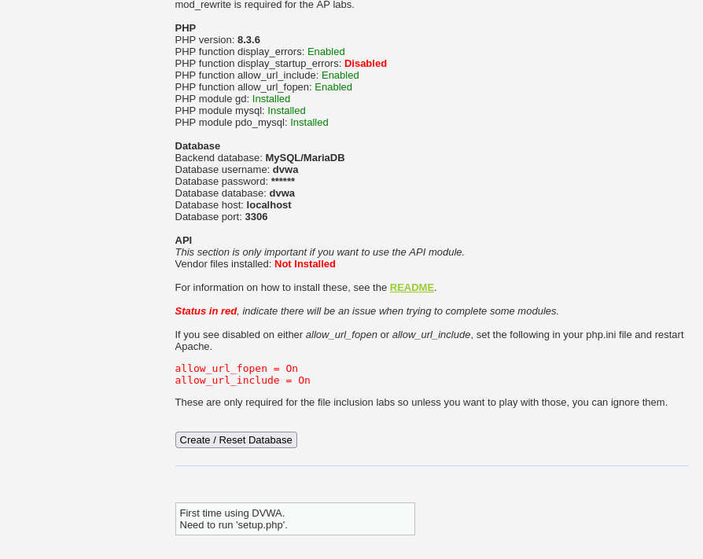{ loading=lazy }
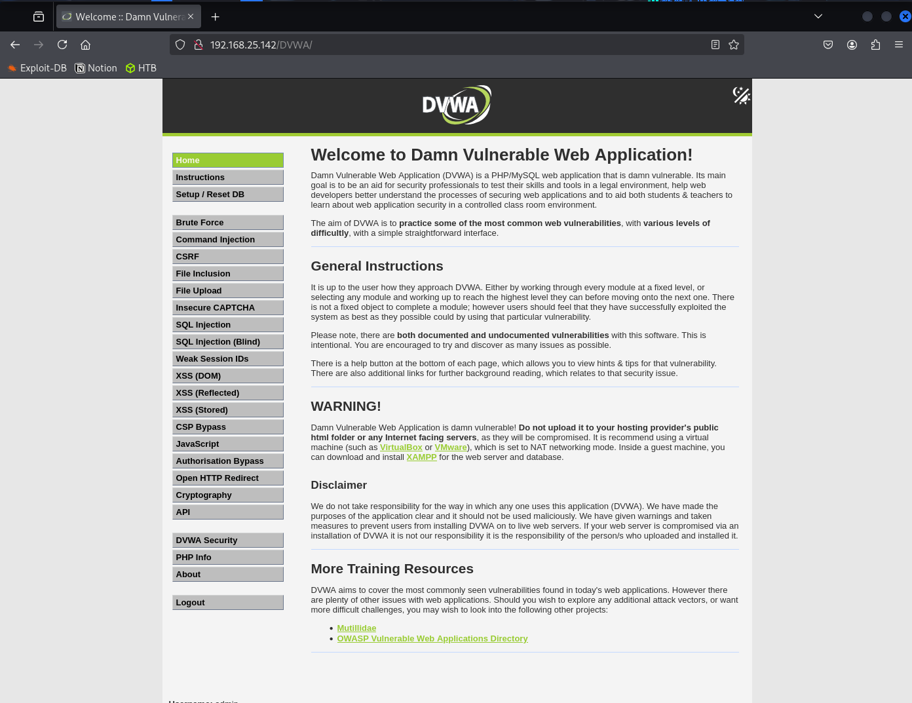{ loading=lazy }
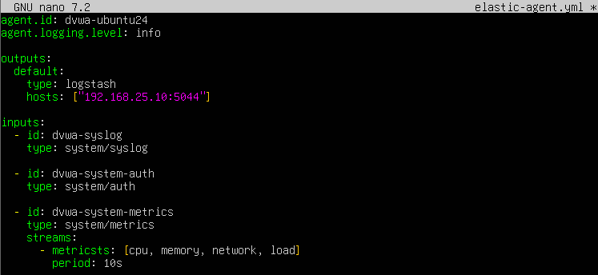{ loading=lazy }
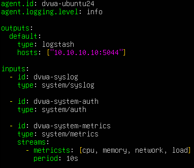{ loading=lazy }
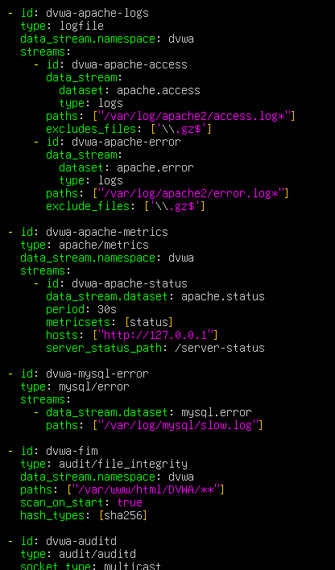{ loading=lazy }
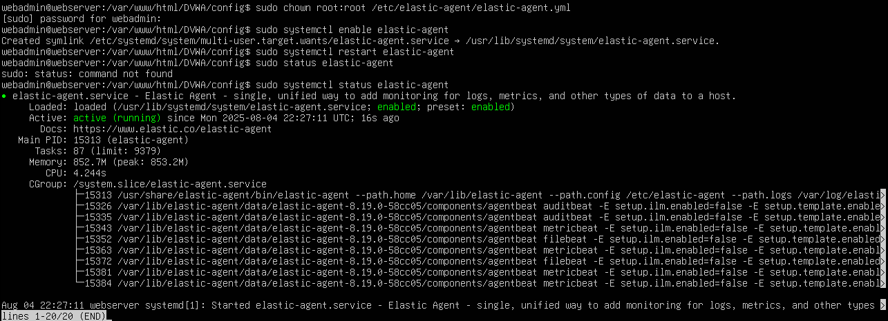{ loading=lazy }
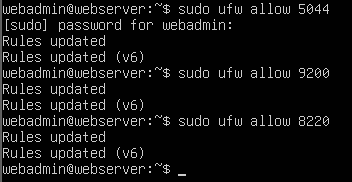{ loading=lazy }
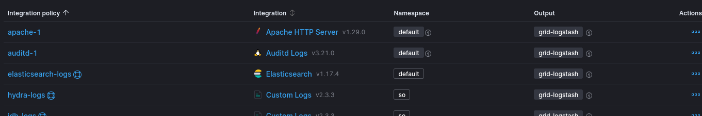{ loading=lazy }
