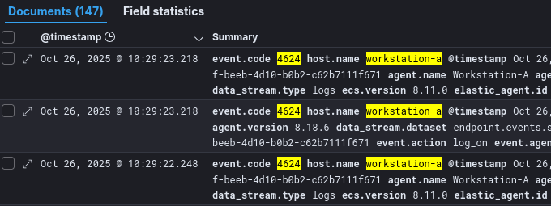
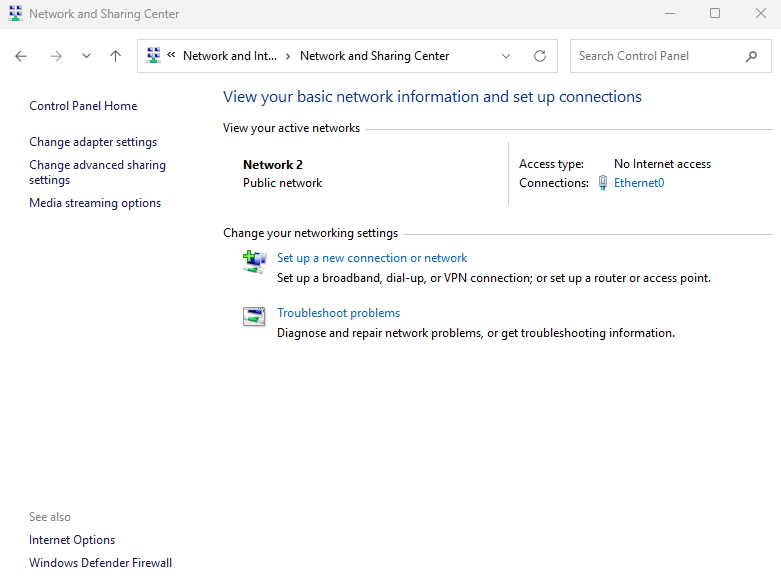
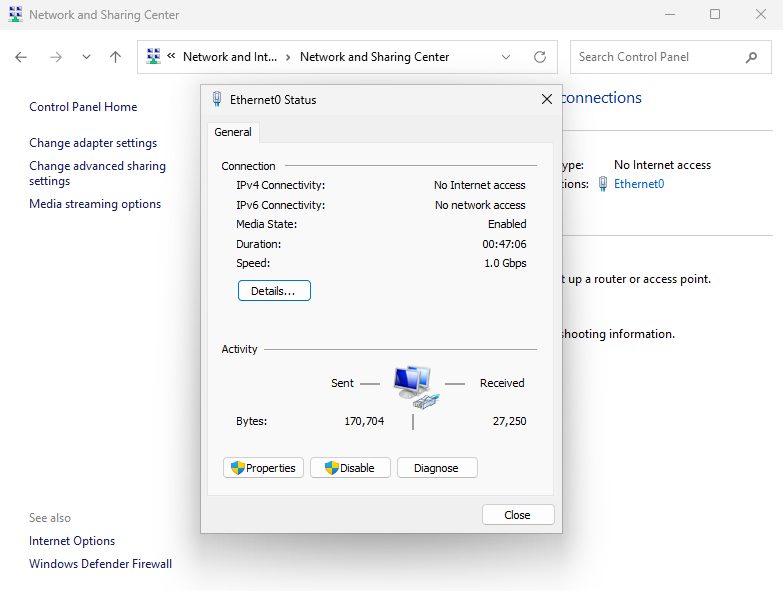
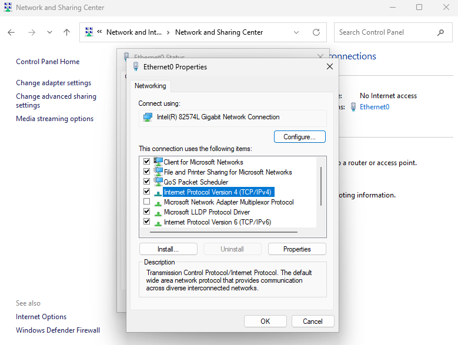
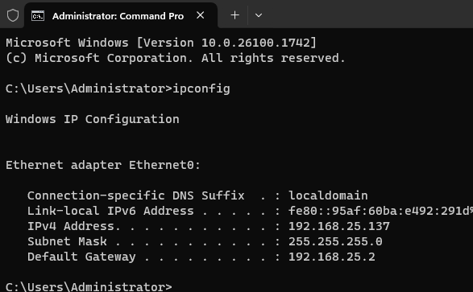
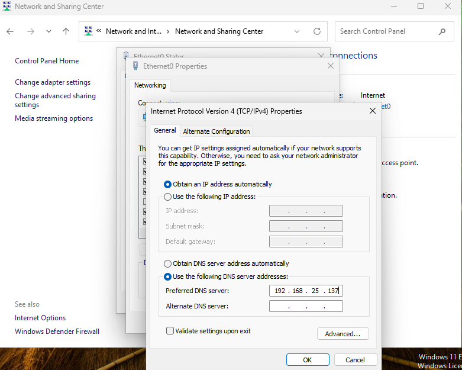
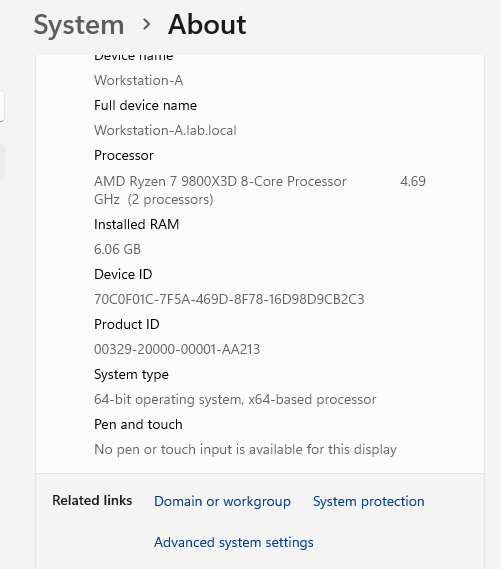
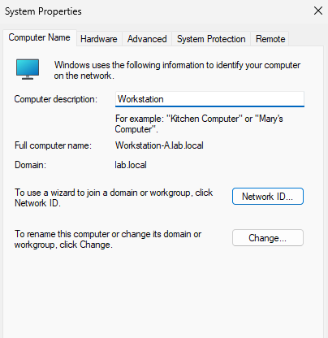
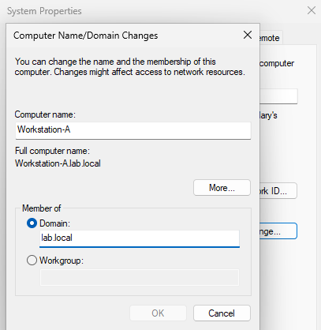
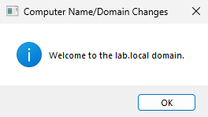

# Windows 11 – Domain‑Joined Workstation

## Purpose
User endpoint targeted for credential theft and lateral movement.

## Specs
- Hostname: `Workstation-A.lab.local`
- IP: `192.168.25.141`
- Logging: Sysmon, Windows event forwarding via Elastic Agent
- 8gb of memory

## Validation
- Confirm Kerberos/NTLM events in Kibana:
```
host.name : workstation-a AND event.code : 4624
```
{ loading=lazy }

## Install (step-by-step)
<Add Fleet agent page, test alerts, KQL snippets>
{ loading=lazy }
{ loading=lazy }
{ loading=lazy }
{ loading=lazy }
{ loading=lazy }
{ loading=lazy }
{ loading=lazy }
{ loading=lazy }
{ loading=lazy }
